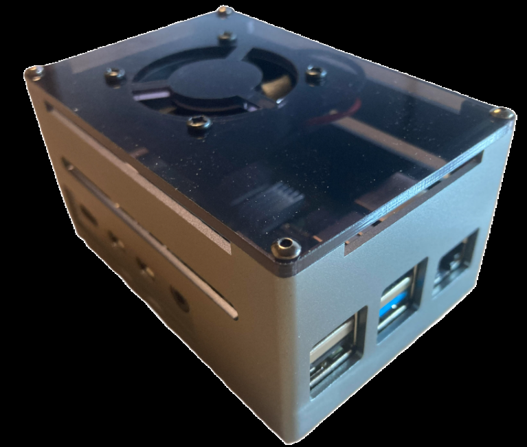
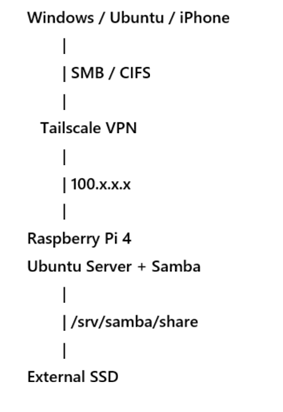
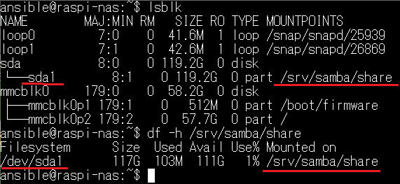
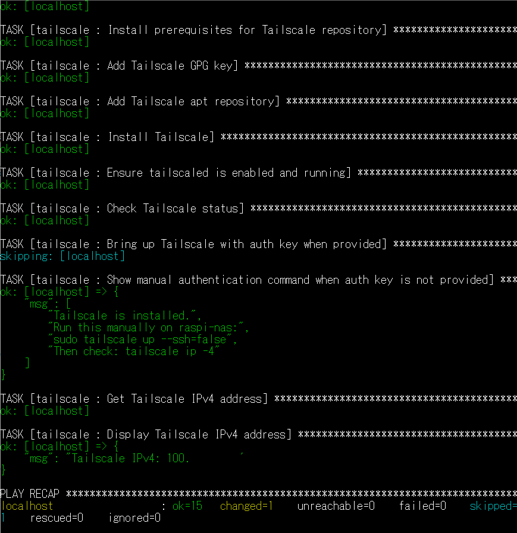

# Raspberry Pi Samba NAS Ansible

Ansible portfolio project for building a Raspberry Pi 4 based Samba NAS with an external SSD and optional Tailscale remote access.

This project configures a Raspberry Pi running Ubuntu Server as a lightweight NAS.  
It uses Samba for file sharing, an external SSD mounted under `/srv/samba/share`, and Tailscale for secure remote access without exposing SMB directly to the Internet.

## Overview

This project demonstrates:

- Raspberry Pi 4 NAS setup with Ubuntu Server
- External SSD mount point management
- Samba file sharing with user authentication
- Ansible role-based configuration
- Optional Tailscale installation for remote access
- SMB access verification from Linux, Windows, and iPhone
- Remote file access over Tailscale without router port forwarding

## Architecture

```text
Windows / Ubuntu / iPhone
        |
        | SMB / CIFS
        |
   Tailscale VPN
        |
        | 100.x.x.x
        |
Raspberry Pi 4
Ubuntu Server
Samba
        |
        | /srv/samba/share
        |
External SSD
```

LAN access example:

```text
\\192.168.x.x\NAS
```

Tailscale access example:

```text
\\100.x.x.x\NAS
smb://100.x.x.x/NAS
```

## Screenshots

### Hardware Setup

Raspberry Pi 4 with external SSD, cooling case, Ethernet connection, and USB power.



### Architecture

Network and service architecture of the Raspberry Pi Samba NAS with Tailscale remote access.



### SSD Mounted as Samba Share

External SSD mounted at `/srv/samba/share` and used as the Samba share directory.



### Ansible Playbook Result

Ansible playbook execution result showing successful role-based configuration.



"""


## Tested Environment

| Component | Value |
|---|---|
| Device | Raspberry Pi 4 |
| OS | Ubuntu Server 24.04 LTS 64-bit |
| Storage | External USB SSD |
| Filesystem | ext4 |
| Share path | `/srv/samba/share` |
| Share name | `NAS` |
| Remote access | Tailscale |
| Configuration tool | Ansible |

## Project Structure

```text
raspi-samba-nas-ansible/
├── inventory.ini
├── site.yml
├── group_vars/
│   └── all.yml
└── roles/
    ├── samba_nas/
    │   ├── handlers/
    │   │   └── main.yml
    │   ├── tasks/
    │   │   └── main.yml
    │   └── templates/
    │       └── smb.conf.j2
    └── tailscale/
        └── tasks/
            └── main.yml
```

## Roles

### samba_nas

This role installs and configures Samba.

Main tasks:

- Install Samba packages
- Create Samba share directory
- Deploy `/etc/samba/smb.conf`
- Enable and start `smbd`
- Configure authenticated access to the `NAS` share

### tailscale

This role installs Tailscale.

Main tasks:

- Add the Tailscale package repository
- Install the `tailscale` package
- Enable and start `tailscaled`
- Display manual authentication instructions when no auth key is provided

For security reasons, this public repository does not include a Tailscale auth key.

## Variables

Example `group_vars/all.yml`:

```yaml
---
samba_workgroup: "WORKGROUP"
samba_share_name: "NAS"
samba_share_path: "/srv/samba/share"
samba_valid_user: "ansible"

tailscale_enable: true
tailscale_authkey: ""
tailscale_args: "--ssh=false"
```

## Inventory

This project is designed to be executed directly on the Raspberry Pi itself.

```ini
[nas]
localhost ansible_connection=local
```

## Usage

Install Ansible on the Raspberry Pi:

```bash
sudo apt update
sudo apt install -y ansible
```

Clone the repository:

```bash
git clone https://github.com/2hasimasqqsan-commits/raspi-samba-nas-ansible.git
cd raspi-samba-nas-ansible
```

Run syntax check:

```bash
ansible-playbook -i inventory.ini site.yml --syntax-check
```

Run the playbook:

```bash
ansible-playbook -i inventory.ini site.yml --ask-become-pass
```

## Samba User Setup

Samba uses its own password database.  
Create or enable the Samba user manually:

```bash
sudo smbpasswd -a ansible
sudo smbpasswd -e ansible
```

Check Samba users:

```bash
sudo pdbedit -L
```

## SSD Mount Example

The external SSD is mounted at:

```text
/srv/samba/share
```

Example `/etc/fstab` entry:

```text
UUID=<your-ssd-uuid> /srv/samba/share ext4 defaults,nofail 0 2
```

After editing `/etc/fstab`:

```bash
sudo systemctl daemon-reload
sudo mount -a
df -h /srv/samba/share
```

## Tailscale Setup

If no auth key is provided, authenticate manually:

```bash
sudo tailscale up --ssh=false
```

Check the Tailscale IP address:

```bash
tailscale ip -4
```

Example remote SMB access:

```text
\\100.x.x.x\NAS
smb://100.x.x.x/NAS
```

## Verification

### Samba configuration check

```bash
testparm
```

### Samba service status

```bash
systemctl status smbd
```

### Linux client test with smbclient

```bash
smbclient -L //192.168.x.x -U ansible
smbclient //192.168.x.x/NAS -U ansible
```

### CIFS mount test from Linux client

```bash
sudo mkdir -p /mnt/raspi-nas
sudo mount -t cifs //192.168.x.x/NAS /mnt/raspi-nas \
  -o username=ansible,vers=3.0,uid=1000,gid=1000,file_mode=0664,dir_mode=0775
```

Write test:

```bash
touch /mnt/raspi-nas/test_from_linux.txt
```

### Windows access

LAN:

```text
\\192.168.x.x\NAS
```

Tailscale:

```text
\\100.x.x.x\NAS
```

### iPhone access

The iOS standard Files app was able to connect and browse the SMB share, but in this test environment it treated the share as read-only.

For full read/write access from iPhone, FE File Explorer Pro was used successfully over Tailscale.

Example connection settings:

```text
Protocol: SMB
Host: 100.x.x.x
Port: 445
Share: NAS
User: ansible
Password: Samba password
```

Verified iPhone upload example:

```text
iPhone
→ FE File Explorer Pro
→ Tailscale
→ Raspberry Pi Samba NAS
→ /srv/samba/share
→ External SSD
```

## Security Notes

Do not expose SMB directly to the Internet.

Avoid this:

```text
Internet → TCP 445 port forwarding → Samba
```

Recommended:

```text
Remote client → Tailscale VPN → Samba
```

This repository does not include:

- Passwords
- Tailscale auth keys
- Private keys
- Real LAN IP addresses
- Real Tailscale IP addresses

## Result

This project successfully verified:

- Raspberry Pi 4 NAS setup
- External SSD mount
- Samba share creation
- Linux client read/write access
- Windows 11 read/write access
- Tailscale remote SMB access
- iPhone image upload over Tailscale using FE File Explorer Pro

## License

This project is licensed under the MIT License. See [LICENSE](LICENSE) for details.
